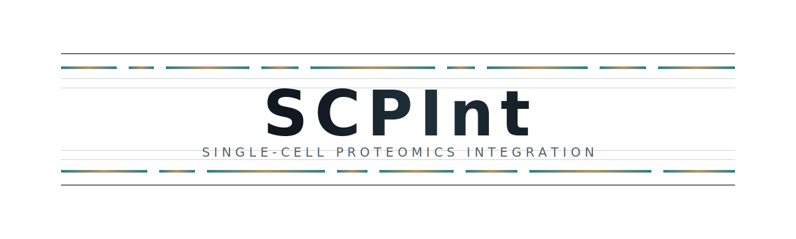

<div align="center">
  
</div>

<div align="center">

[](https://www.python.org/)
[](https://pytorch.org/)
[](https://doi.org/10.5281/zenodo.20537625)
[](LICENSE)


</div>

SCPInt is a deep-learning framework for integrating heterogeneous mass spectrometry-based single-cell proteomics datasets. It learns unified biological embeddings while explicitly disentangling and quantifying batch-associated technical variation.

SCPInt was evaluated across 6 integration tasks comprising 18 datasets from 8 independent studies, spanning multiple technologies, sample preparation conditions, and biological contexts.

---

## Overview

Mass spectrometry-based single-cell proteomics (SCP) enables direct measurement of cellular functional states, but its low throughput makes robust cross-dataset integration essential. Existing single-cell integration methods were primarily designed for count-based sequencing data and do not fully model SCP measurements, which are continuous, sparsely observed, and shaped by platform- and preparation-specific technical effects.

SCPInt addresses these challenges with an adversarial autoencoder that separates biological and technical representations. The model combines a two-component Gaussian mixture decoder tailored to SCP expression profiles with batch-aware adversarial training.

## Highlights

- Dedicated SCP likelihood: a two-component Gaussian mixture model for continuous proteomic measurements and heterogeneous missingness.
- Explicit representation disentanglement: biological embeddings and batch embeddings are learned as separate latent spaces.
- Quantitative technical phenotypes: batch embeddings provide interpretable measurements of platform bias, cryopreservation effects, and cell-type-specific technical sensitivity.
- Atlas-scale integration: continuous developmental manifolds are preserved in human brain SCP data.
- Broad benchmarking: 6 integration tasks, 18 datasets, 8 independent studies, and multiple MS technologies.

## Model Architecture


SCPInt consists of three core components:

1. Encoder: maps proteomic profiles into biological and batch-associated latent representations.
2. Biological decoder: reconstructs expression profiles from biological embeddings and batch labels using a two-component Gaussian mixture model.
3. Batch adversary: predicts batch identity from biological embeddings through gradient reversal, encouraging batch-invariant biological representations.

## Installation

### Prerequisites

| Package | Version tested |
| --- | --- |
| Python | 3.10+ |
| PyTorch | 2.6.0+cu118 |
| NumPy | 2.2.6 |
| Scanpy | 1.11.5 |
| Pandas | 2.3.3 |

A single consumer GPU is sufficient for the reported experiments. The model has been tested on an NVIDIA RTX 2080 Ti with 11 GB VRAM.

### Setup

```bash
git clone https://github.com/YuzhiSun/SCPInt.git
cd SCPInt

conda create -n scpint python=3.10
conda activate scpint

pip install torch==2.6.0 torchvision==0.21.0 torchaudio==2.6.0 --index-url https://download.pytorch.org/whl/cu118
pip install -r requirements.txt
```

For CPU-only testing, replace the PyTorch installation command with the CPU wheel recommended by the [PyTorch installation guide](https://pytorch.org/get-started/locally/).

## Quick Start

The following smoke test runs without downloading the full benchmark datasets.

```python
from pathlib import Path
import sys

import anndata as ad
import numpy as np

sys.path.insert(0, str(Path("code").resolve()))
from SCPIntModel import AnnDataProcessor, Trainer, scProteoIntegrator

rng = np.random.default_rng(7)
adata = ad.AnnData(
    X=rng.normal(size=(64, 120)).astype("float32")
)
adata.obs["batch"] = np.repeat(["batch_1", "batch_2"], 32)

processor = AnnDataProcessor(adata, batch_key="batch")
dataloader = processor.make_dataloader(batch_size=16)

model = scProteoIntegrator(
    n_genes=processor.n_genes,
    n_batches=processor.n_batches,
)
trainer = Trainer(model, lr=1e-3, device="cpu")
trainer.fit(dataloader, n_epochs=2, adv_warmup_epochs=1)

X_tensor, _ = processor.to_tensors()
bio_emb, batch_emb = trainer.encode(X_tensor)
adata.obsm["X_scpint"] = bio_emb.numpy()
adata.obsm["X_scpint_batch"] = batch_emb.numpy()
```

For your own data, replace the synthetic `AnnData` object with:

```python
adata = ad.read_h5ad("your_data.h5ad")
```

The input `AnnData` object should contain:

- `adata.X`: cells by proteins expression matrix.
- `adata.obs["batch"]`: batch, technology, preparation, or dataset label used for integration.

## Tutorials

The `code/` directory contains task-specific Jupyter notebooks:

| Task | Training notebook | Analysis notebook |
| --- | --- | --- |
| Cross-technology integration | [`Train_task_cross_tech.ipynb`](code/Train_task_cross_tech.ipynb) | [`Product_cross_tech.ipynb`](code/Product_cross_tech.ipynb) |
| Multi-batch integration | [`Train_task_multibach.ipynb`](code/Train_task_multibach.ipynb) | [`Product_multibatch.ipynb`](code/Product_multibatch.ipynb) |
| Three-technology integration | [`Train_task_three_tech.ipynb`](code/Train_task_three_tech.ipynb) | [`Product_three_tech.ipynb`](code/Product_three_tech.ipynb) |
| Human brain SCP atlas | [`Train_task_human_brain_scp.ipynb`](code/Train_task_human_brain_scp.ipynb) | [`Product_human_brain_scp.ipynb`](code/Product_human_brain_scp.ipynb) |
| Macrophage LPS activation | [`Train_task_lps.ipynb`](code/Train_task_lps.ipynb) | [`Product_lps.ipynb`](code/Product_lps.ipynb) |
| Frozen vs. fresh comparison | [`Train_task_frozen_fresh.ipynb`](code/Train_task_frozen_fresh.ipynb) | [`Product_frozen_fresh.ipynb`](code/Product_frozen_fresh.ipynb) |

## Data Availability

All datasets used in this study are available from Zenodo:

[](https://doi.org/10.5281/zenodo.20537625)

After downloading the data, place the `.h5ad` files under `data/`. See [`data/README.md`](data/README.md) for details.

## Repository Structure

```text
SCPInt/
|-- code/
|   |-- SCPIntModel.py
|   |-- Train_task_cross_tech.ipynb
|   |-- Product_cross_tech.ipynb
|   |-- Train_task_multibach.ipynb
|   |-- Product_multibatch.ipynb
|   |-- Train_task_three_tech.ipynb
|   |-- Product_three_tech.ipynb
|   |-- Train_task_human_brain_scp.ipynb
|   |-- Product_human_brain_scp.ipynb
|   |-- Train_task_lps.ipynb
|   |-- Product_lps.ipynb
|   |-- Train_task_frozen_fresh.ipynb
|   `-- Product_frozen_fresh.ipynb
|-- data/
|   `-- README.md
|-- figure/
|   |-- logo.svg
|   `-- figures1.png
|-- requirements.txt
|-- LICENSE
`-- README.md
```

## Benchmark Tasks

| # | Task | Datasets | Biological context |
| --- | --- | --- | --- |
| 1 | Cross-technology | 4 datasets | Same cell type across different MS platforms |
| 2 | Multi-batch | 4 datasets | Multiple batches from the same technology |
| 3 | Three-technology | 3 datasets | Integration across three MS technologies |
| 4 | Human brain atlas | 4 datasets | Developmental trajectory across brain regions |
| 5 | LPS activation | 3 datasets | Macrophage activation states |
| 6 | Frozen vs. fresh | 2 datasets | Cryopreservation effect on proteomic profiles |

## Citation

If you use SCPInt in your research, please cite:

```bibtex
@article{sun2025scpint,
  title   = {SCPInt: explicit disentanglement of biological and batch variation
             for single-cell proteomics integration},
  author  = {Sun, Yuzhi and others},
  journal = {Under review},
  year    = {2025}
}
```

The complete citation will be updated after publication.

## Contact

For questions, suggestions, or collaboration inquiries:

- Yuzhi Sun: [yuzhi@stu.hit.edu.cn](mailto:yuzhi@stu.hit.edu.cn)
- GitHub Issues: [https://github.com/YuzhiSun/SCPInt/issues](https://github.com/YuzhiSun/SCPInt/issues)

## License

This project is released under the MIT License. See [`LICENSE`](LICENSE) for details.
