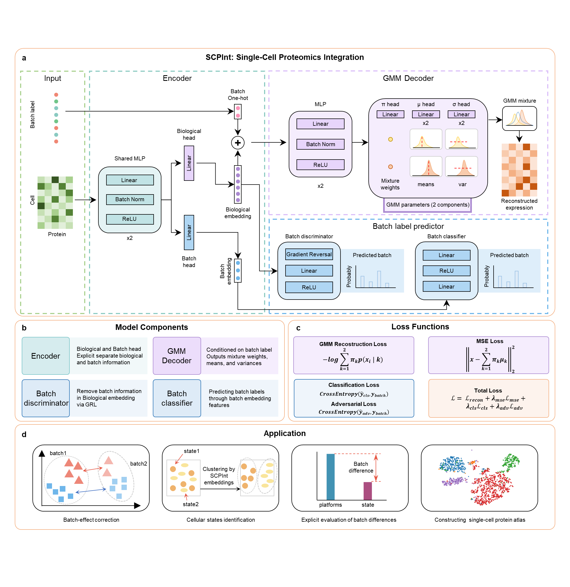

# SCPInt
### SCPInt: explicit disentanglement of biological and batch variation for single-cell proteomics integration
Mass spectrometry-based single-cell proteomics (SCP) enables direct and unbiased measurement of cellular functional states, but its inherently low throughput necessitates integration across multiple datasets to support downstream analysis and atlas-scale studies. Existing single-cell integration methods were primarily developed for count-based sequencing data and do not adequately model SCP measurements, which exhibit continuous distributions, heterogeneous missing structures, and substantial platform- and preparation-specific technical variation. Here we present SCPInt, a deep-learning framework that learns a unified biological representation across heterogeneous MS-based SCP datasets while explicitly disentangling and quantifying technical variation. SCPInt combines a two-component Gaussian mixture model tailored to SCP expression characteristics with an adversarial architecture that separately encodes biological information and batch-associated information into biological embeddings and batch embeddings. Across six integration tasks comprising 18 datasets from eight independent studies and spanning multiple technologies, developmental stages, and sample preparation conditions, SCPInt consistently outperformed existing approaches in preserving biological structure and establishing unified cross-dataset representations. SCPInt preserved continuous developmental manifolds in human brain SCP data, enabling reconstruction of proteomic developmental trajectories and atlas-scale integration, and identified biologically meaningful macrophage activation states across datasets. Moreover, its batch embeddings provide quantitative technical phenotypes that capture platform bias, cryopreservation-associated effects, and cell-type-specific technical sensitivity. SCPInt thus shifts SCP integration from implicit batch-effect removal toward unified biological representation coupled with explicit, interpretable, and quantitative analysis of technical variation, providing a foundation for scalable SCP atlas construction and systematic evaluation of experimental workflows.

## Requirements
- pytorch==2.6.0+cu118
- numpy==2.2.6
- scanpy==1.11.5
- pandas==2.3.3

## Questions
If you have any suggestions/ideas for msInfer, please don't hesitate to reach out to us. You can reach us by email(yuzhi@stu.hit.edu.cn).
